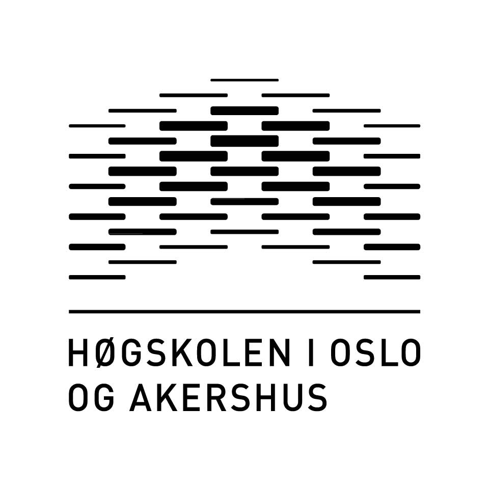

<p align="right"></p>


## About the Project
This is a bachelorproject and developed by students attending [Høgskolen i Oslo og Akershus](http://www.hioa.no/) in cooperation with [NC-Spectrum](https://www.nc-spectrum.no/).
The aim for this project was to develope a web solution prototype of a visitor management software for our employer.


## Installing the Project
Before running this project there are some installations that needs to be done. 
1. Installing [Composer](https://getcomposer.org/doc/00-intro.md), a tool for dependency management in PHP.
2. Installing [Laravel](https://laravel.com/docs/5.4/installation), the PHP framework we are using.

The previous steps are the only requirements to run a Laravel project. 
However, in order to run our project optimally and to see the projects full potential there are some additional plugins that we recommend you to install.
1. Installing [Laravel Collective](https://laravelcollective.com/docs/master/html), for shortcuts, easier syntax and coding experience.
2. Installing [Bootstrap Validation](https://github.com/1000hz/bootstrap-validator), for proper input validation.
3. Installing [Imageintervention](http://image.intervention.io/), for proper image manipulation.


## Running the Project
To run the project you need to use the terminal on Mac or Command line on Windows.
1. [Change the path to the project and the following code to run the project on a local server](https://laravel.com/docs/5.4).
```
php artisan serve
```
2. [In order to enable the database, you first need to connect the project to your database](https://laravel.com/docs/5.4/database).
3. In order to generate data you need to migrate our tables into the database and seed them. 
```
php artisan migrate:refresh --seed
```
Now you can hopefully run the project as it is supposed to be ran.


## Developers
- Erik Li
- Joakim Møller
- Andreas Stensrud
- Emil Richardsen Nedregård


## License
All rights reserved to our school, [Høgskolen i Oslo og Akershus](http://www.hioa.no/), and our bachelorproject employer, [NC-Spectrum](https://www.nc-spectrum.no/).

<p align="center"></p>
